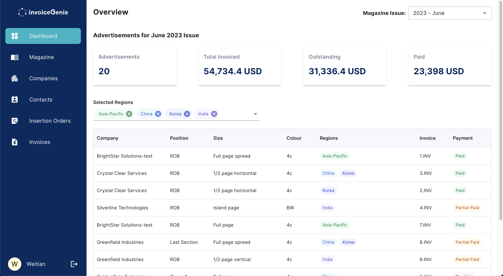
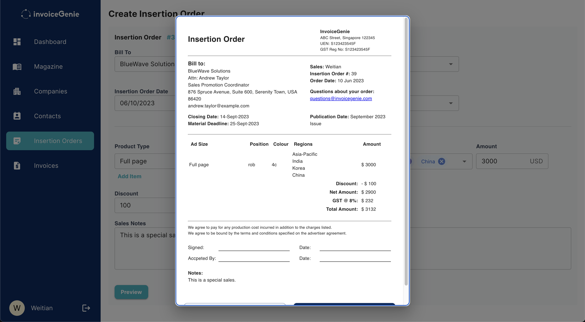
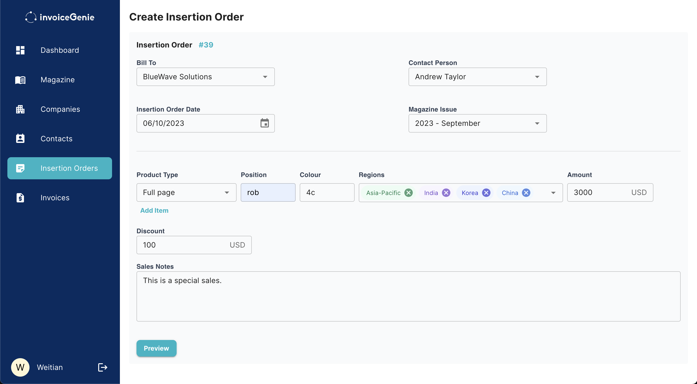

# invoiceGenie

An application that helps to track advertisements placement for a publication.

## Live Site

[https://invoice-frontend-wiay.onrender.com](https://invoice-frontend-wiay.onrender.com)

Login with the following:  
Email: contact.invoicegenie@gmail.com  
PW: geNie@89757

## Screenshots






## Main Features

- Create insertion orders for sales of advertising space
- Create invoices based on details in insertion orders
- Invoices uses daily exchange rate taken from [MAS API](https://www.mas.gov.sg/statistics/exchange-rates)
- Add payments to invoices
- Overview of all advertisements space sold for each issue
- Add administrators to the application with [Auth0](https://auth0.com/) authentication

## Tech Used

- Frontend: [React](https://react.dev/)
- Backend: [Express.js](https://expressjs.com/)
- Database: [Sequelize (ORM)](https://sequelize.org/), [PostgreSQL](https://www.postgresql.org/)
- Routing: [React Router](https://reactrouter.com/en/main)
- UI: [Material-UI](https://mui.com/)
- Storage: [Firebase](https://firebase.google.com/)
- Forms: [React Hook Forms](https://react-hook-form.com/)
- Authentication: [Auth0](https://auth0.com/)
- Cron Job: [Cron](https://www.npmjs.com/package/cron)
- PDF Export: [jspdf](https://www.npmjs.com/package/jspdf)

## Setup

1. Clone repo to local

2. Configure `.env` file, make sure to get your own API keys stated below and insert it into your `.env` file

   - If unsure where to get API keys, refer to the Tech Used for the documents

   ```
   REACT_APP_DOMAIN= <Auth0 Domain>
   REACT_APP_CLIENT_ID= <Auth0 client id>
   REACT_APP_AUDIENCE= <Auth0 app audience>
   REACT_APP_DB_SERVER= <Backend server URL>
   REACT_APP_FIREBASE_API= <Firebase API key>
   ```

3. `npm i` to install all dependencies

4. Clone and setup backend at [invoice-app-backend](https://github.com/hWeitian/invoice-app-backend)

5. `npm start` to run the application

## Furture Features

- Create credit notes to offset/cancel invoices
- Send insertion orders and invoices directly to clients
- Export all invoices and insertion orders into Excel file
- Send email reminder to administrator on the outstanding invoices
- Create annual sales report
